

  

<h1 align="center">Epdf</h1>

  <b>Every PDF tool. One app. Fully offline.</b> 
  View, edit, sign, redact, OCR and compare PDFs — in any language, right-to-left included.

  
  
  
  

  <a href="#features">Features</a> ·
  <a href="#every-language">Every language</a> ·
  <a href="#private-by-design">Privacy</a> ·
  <a href="#install">Install</a> ·
  <a href="#documentation">Documentation</a> ·
  <a href="docs/DEVELOPMENT.md">Build from source</a>

https://github.com/user-attachments/assets/71d481ae-dc6f-4f1c-86f0-3fd5c69027b7

A 36-second tour of Epdf. Video not playing? <a href="docs/media/epdf-demo.mp4">Download it</a>.

---

## Why Epdf

- **Everything in one place.** Reading, commenting, editing, filling and signing, redaction, OCR, comparison,
  compression, passwords, page organizing, conversion to and from Office — no second tool, no add-ons.
- **Every language.** Arabic and other right-to-left scripts are first-class: shaped correctly when Epdf writes them,
  and read in the right order when you select, copy, search or edit text in existing PDFs.
- **Private by design.** Your documents never leave your PC. No account, no cloud, no telemetry.
- **Nothing else to install.** OCR, Office conversion, encryption and every other feature are built in.

## Features

<table>
  <tr>
    <td width="50%" valign="top">
      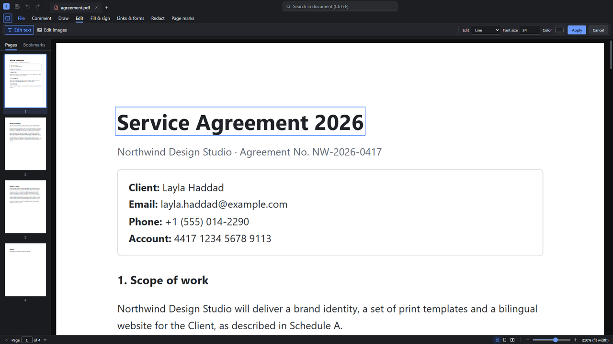
      <h3>Edit text and images</h3>
      Change the words already on the page — including Arabic — or move, replace and resize pictures, with undo for every
      step. <a href="docs/features/edit-content.md">Learn more</a>
    </td>
    <td width="50%" valign="top">
      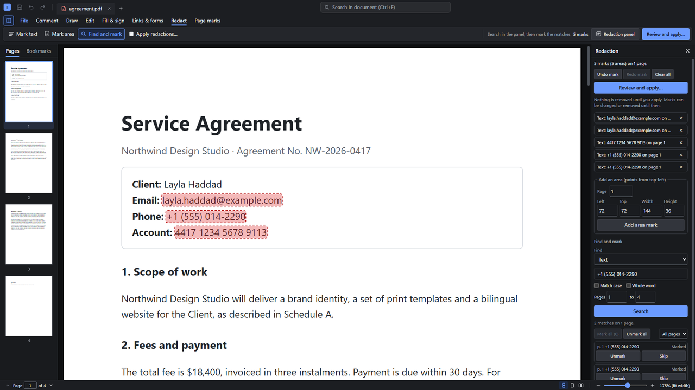
      <h3>Redact, permanently</h3>
      Mark text, areas, search results or patterns such as e-mail addresses and account numbers. Epdf removes the content
      itself, then checks the saved file to prove it is gone. <a href="docs/features/redact.md">Learn more</a>
    </td>
  </tr>
  <tr>
    <td width="50%" valign="top">
      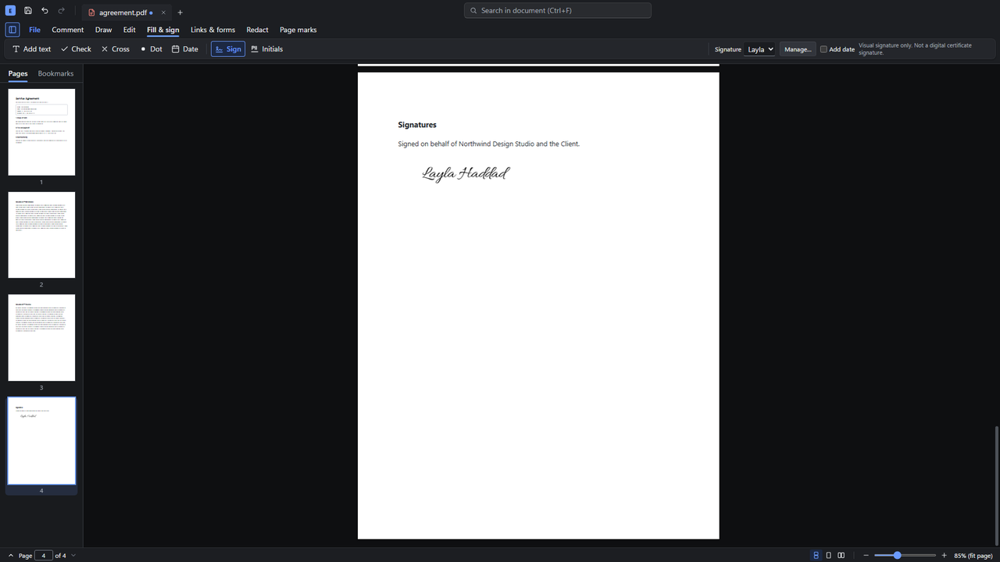
      <h3>Fill &amp; sign</h3>
      Draw, type or import a signature, add text, dates and check marks anywhere, and fill interactive forms. Items stay
      editable until you choose to lock them into the page. <a href="docs/features/forms-signing.md">Learn more</a>
    </td>
    <td width="50%" valign="top">
      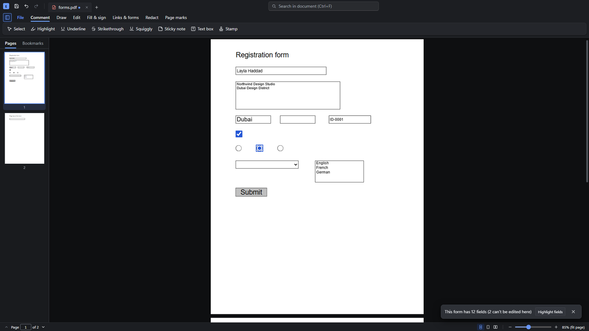
      <h3>Build forms</h3>
      Turn a flat PDF into a fillable form: Epdf detects the fields for you, or you draw them, set validation and choose the
      tab order. <a href="docs/features/form-builder.md">Learn more</a>
    </td>
  </tr>
  <tr>
    <td width="50%" valign="top">
      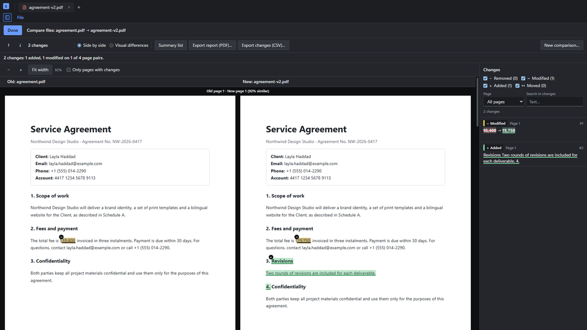
      <h3>Compare versions</h3>
      See two versions side by side with every change listed, jump between changes, and export a report.
      <a href="docs/features/compare.md">Learn more</a>
    </td>
    <td width="50%" valign="top">
      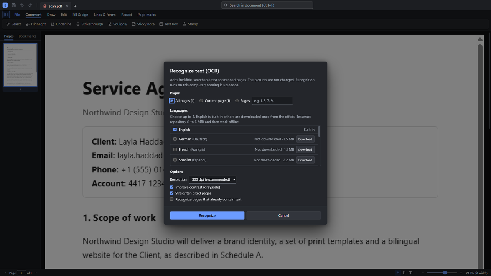
      <h3>OCR for scanned pages</h3>
      Make scans searchable and selectable in English, Arabic and 14 more languages, entirely on your PC.
      <a href="docs/features/ocr.md">Learn more</a>
    </td>
  </tr>
  <tr>
    <td width="50%" valign="top">
      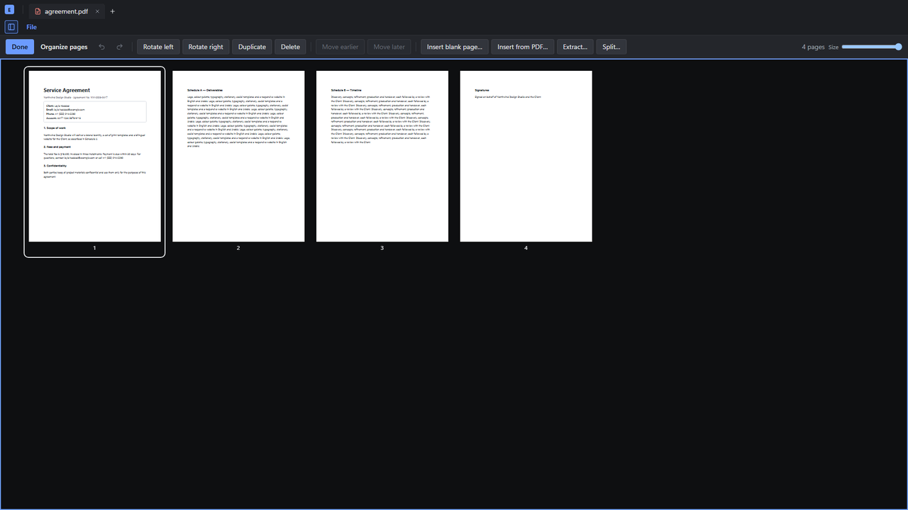
      <h3>Organize pages</h3>
      Reorder, rotate, insert, extract, split and delete pages, combine files, and print.
      <a href="docs/features/pages-print.md">Learn more</a>
    </td>
    <td width="50%" valign="top">
      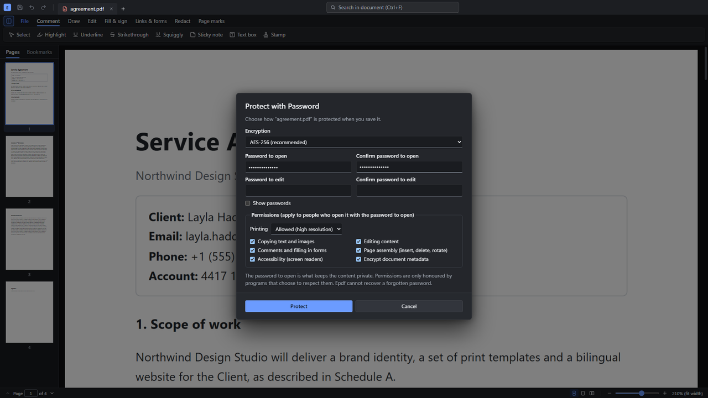
      <h3>Password protection</h3>
      AES-256 encryption with separate passwords to open and to edit, and fine-grained permissions.
      <a href="docs/features/security.md">Learn more</a>
    </td>
  </tr>
  <tr>
    <td width="50%" valign="top">
      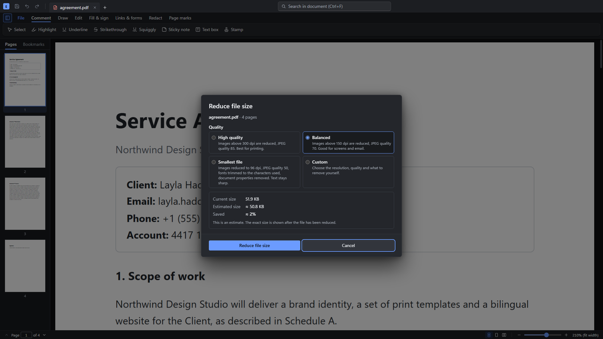
      <h3>Reduce file size</h3>
      Presets from high quality to smallest file, with an estimate before you start. Epdf never makes a file larger.
      <a href="docs/features/compress.md">Learn more</a>
    </td>
    <td width="50%" valign="top">
      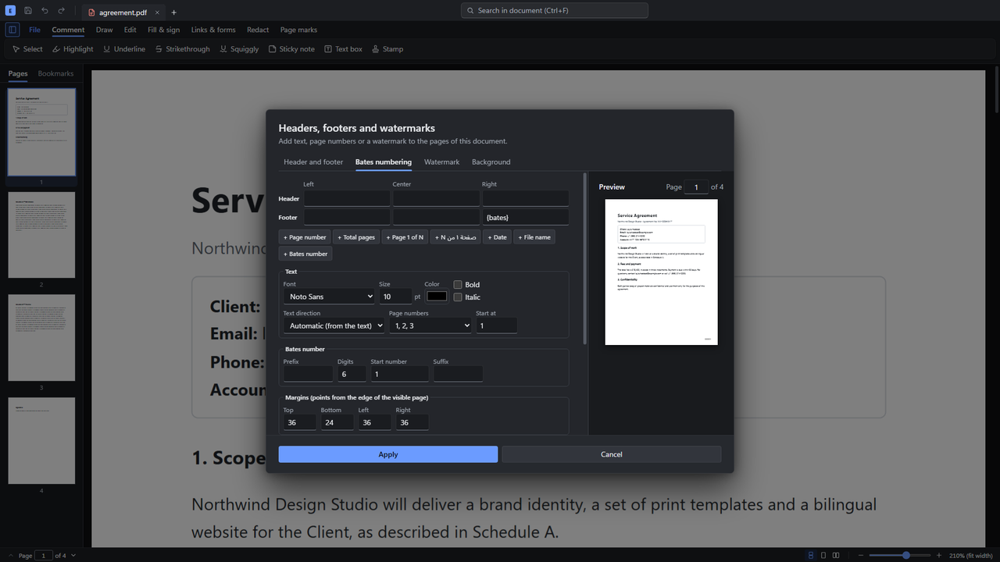
      <h3>Headers, page numbers and Bates</h3>
      Add headers and footers, page numbers, Bates numbering, watermarks and backgrounds, with a live preview.
      <a href="docs/features/headerfooter.md">Learn more</a>
    </td>
  </tr>
</table>

**Also included:**
[comments and markup](docs/features/markup.md) with replies ·
[create PDFs](docs/features/create-export.md) from Word, Excel, PowerPoint, pictures and web pages ·
[export to Word, Excel and PowerPoint](docs/features/create-export.md) ·
[scan](docs/features/scan.md) from a scanner, webcam or phone ·
[links and bookmarks](docs/features/links-bookmarks.md) ·
a searchable [library](docs/features/library.md) of your PDF folders ·
version history, autosave and crash recovery.

## Every language

<table>
  <tr>
    <td width="50%" valign="top">
      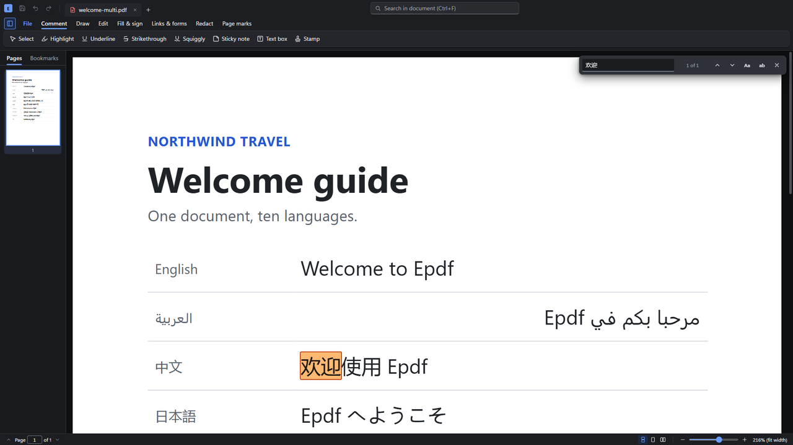
      <b>Find anything, in any script.</b> Search, select and copy text in Arabic, Persian, Urdu, Chinese, Hindi,
      Russian and more, in the order it is read.
    </td>
    <td width="50%" valign="top">
      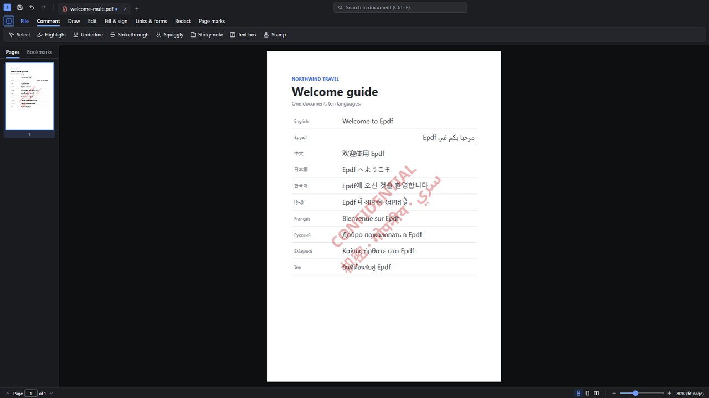
      <b>Written into the page, correctly.</b> Text Epdf adds — form fields, stamps, signatures, watermarks, page numbers
      — is shaped properly, so Arabic letters join and right-to-left lines read right to left.
    </td>
  </tr>
</table>

How it works: [the text engine](docs/text-engine.md) (writing) and [the page text model](docs/page-text.md) (reading).
Converting Office documents in right-to-left languages is covered in [Office → PDF](docs/features/office-rtl.md).

## Private by design

- Every feature runs on your PC. Epdf has no account, no cloud service and no telemetry.
- The only network use is optional and always asked for: downloading an extra OCR language, and checking for updates
  (which you can turn off). Downloads are checked against their published checksums before they are used.
- PDF JavaScript is never run, and the app's window is sandboxed and locked down. Details are in the
  [security model](docs/DEVELOPMENT.md#security-model).

## Install

Epdf is a beta for **Windows** (64-bit; tested on Windows 11), **macOS** (13 or later, Apple Silicon and Intel; tested
on macOS 26 with Apple Silicon) and **Linux** (64-bit; tested on Ubuntu 26.04). Download it from
[epdf.ing](https://epdf.ing); every release, with its notes, is also on [GitHub](https://github.com/Mannai/EPDF/releases).

| Download | For |
|---|---|
| `Epdf-Setup-<version>.exe` | Windows, most people. Installs for your account only (no admin rights), adds Start menu and desktop shortcuts, and offers Epdf under **Open with** for PDFs. Available in English, Arabic, French, German and Spanish. |
| `Epdf-<version>.msi` | Windows, IT departments: silent deployment with `msiexec /i "Epdf-<version>.msi" /qn`. |
| `Epdf-<version>-universal.dmg` | Mac: open it and drag Epdf into Applications. One download for Apple Silicon and Intel. (The `.zip` holds the same app.) |
| `Epdf-<version>-amd64.deb` | Ubuntu, Debian and their relatives: `sudo apt install ./Epdf-<version>-amd64.deb`. |
| `Epdf-<version>-x86_64.AppImage` | Other Linux distributions: make it executable and run it. |

The beta is not code-signed yet, so Windows SmartScreen shows a warning the first time; choose **More info ▸ Run
anyway**. On Linux and macOS, Epdf asks you to accept the license agreement the first time it starts. To build the
installers yourself, see [Packaging](docs/DEVELOPMENT.md#packaging).

### Opening Epdf on a Mac the first time

The Mac app is not signed with an Apple Developer ID or notarized by Apple yet, so macOS stops it the first time
with a message such as “Apple could not verify “Epdf” is free of malware”. You allow it once, and after that Epdf
opens normally:

1. Drag Epdf from the disk image into **Applications**, then double-click it there. When macOS says it can't open
   Epdf, click **Done** (not Move to Trash).
2. Open **System Settings ▸ Privacy & Security**, scroll down to the message about Epdf, and click **Open Anyway**.
   Confirm with your password or Touch ID, then click **Open Anyway** again.

On macOS 14 (Sonoma) and earlier you can instead Control-click (or right-click) Epdf in Applications, choose
**Open**, and click **Open** in the dialog. (In Terminal, `xattr -dr com.apple.quarantine /Applications/Epdf.app`
does the same.)

Epdf tells you when a new version is out and opens its download page; it doesn't update itself on a Mac. To update,
quit Epdf, then drag the new version into Applications and choose **Replace**. macOS may then ask once whether Epdf
may use its key in your keychain (it protects your saved signatures): click **Always Allow**.

## Documentation

| | |
|---|---|
| **Using Epdf** | [Window and ribbon](docs/features/chrome.md) · [Comments and markup](docs/features/markup.md) · [Fill &amp; sign](docs/features/forms-signing.md) · [Edit text and images](docs/features/edit-content.md) · [Pages and printing](docs/features/pages-print.md) · [Create, combine and export](docs/features/create-export.md) · [Links and bookmarks](docs/features/links-bookmarks.md) · [Headers, footers and watermarks](docs/features/headerfooter.md) |
| **Protect and prepare** | [Redaction](docs/features/redact.md) · [Password protection](docs/features/security.md) · [Reduce file size](docs/features/compress.md) · [Form builder](docs/features/form-builder.md) · [Compare files](docs/features/compare.md) |
| **Scans and search** | [OCR](docs/features/ocr.md) · [Scan to PDF](docs/features/scan.md) · [Library](docs/features/library.md) |
| **Languages** | [Text engine](docs/text-engine.md) · [Page text model](docs/page-text.md) · [Office → PDF in right-to-left scripts](docs/features/office-rtl.md) |
| **Developers** | [Build, test and package](docs/DEVELOPMENT.md) · [Writing a feature](docs/FEATURES.md) · [Known limitations](docs/LIMITATIONS.md) |

## Status

Epdf is in beta. It is tested by about 2,700 unit tests and 450 end-to-end tests that drive the real app. What is not
done or not verified yet is listed honestly in [Known limitations](docs/LIMITATIONS.md).

## License

Copyright © 2026 Epdf. Epdf is **source-available, not open source**: the code and the installers are
published under the [PolyForm Strict License 1.0.0](LICENSE.md).

| | |
|---|---|
| Read the code, download the installers, use Epdf for personal or other noncommercial purposes | Allowed |
| Use by charities, schools, public research, public health or government organizations | Allowed |
| Changing the code, building on it, or sharing copies of it or of the installers | Not allowed |
| Use in or for a business, selling it, or offering it as part of a product or service | Not allowed without a commercial license |

For a commercial license or any other permission, contact sales@epdf.ing. For help, write to support@epdf.ing.

Installing Epdf also means accepting its [End User License Agreement](build/license.txt): the installer shows it and
installs nothing until you click **I Agree**. It ships with the app (**Help ▸ End User License Agreement**).

Third-party components keep their own licenses; their full texts ship with Epdf in `THIRD-PARTY-NOTICES.txt`
(**Help ▸ Third-Party Notices**). See also
[Licensing and self-containment](docs/DEVELOPMENT.md#licensing-and-self-containment).
